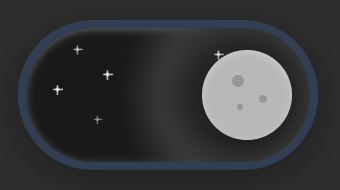

# Day/Night Slider ✨

Animated slider that smoothly transitions from sunny day to starry night with position-based animations, layered gradients, and floating clouds/twinkling stars.

 

🎥 [Watch Demo Video](day-night-slider.mp4)

Motivated by [this](https://www.reddit.com/r/programmingmemes/s/GB7uYTwpyD) Reddit post.