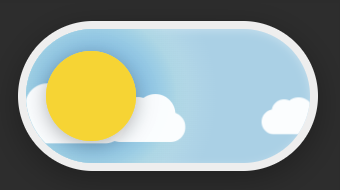
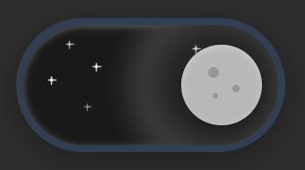
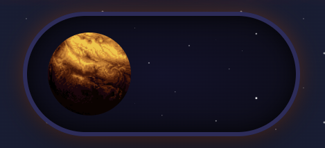
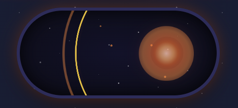

# Fancy Sliders

## Day/Night Slider ✨

Animated slider that smoothly transitions from sunny day to starry night with position-based animations, layered gradients, and floating clouds/twinkling stars.

🎥 [Watch Demo Video](day_night_slider/day-night-slider.mp4)

## Zebes Explosion Slider 💥

Space-themed slider where Planet Zebes explodes into particles and leaves a glowing core when dragged to the right, with smooth reset and fade-in effects.

🎥 [Watch Demo Video](zebes_explode_slider/zebes-explode-slider.mp4)

Motivated by [this](https://www.reddit.com/r/programmingmemes/s/GB7uYTwpyD) Reddit post.

Made with AI (Cursor)
